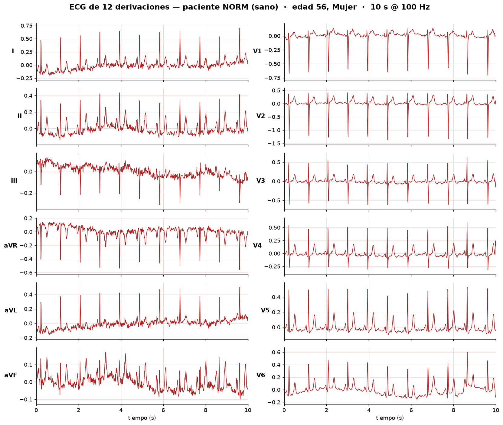
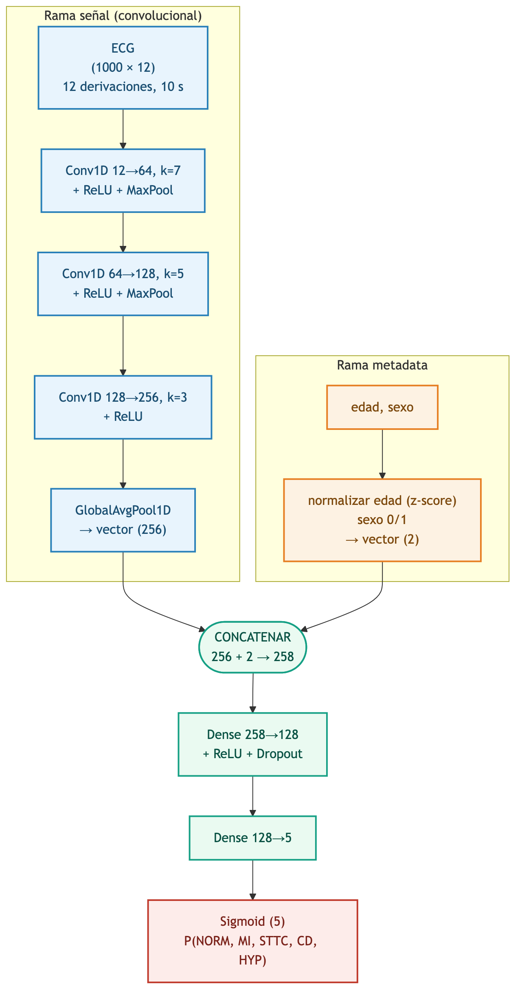
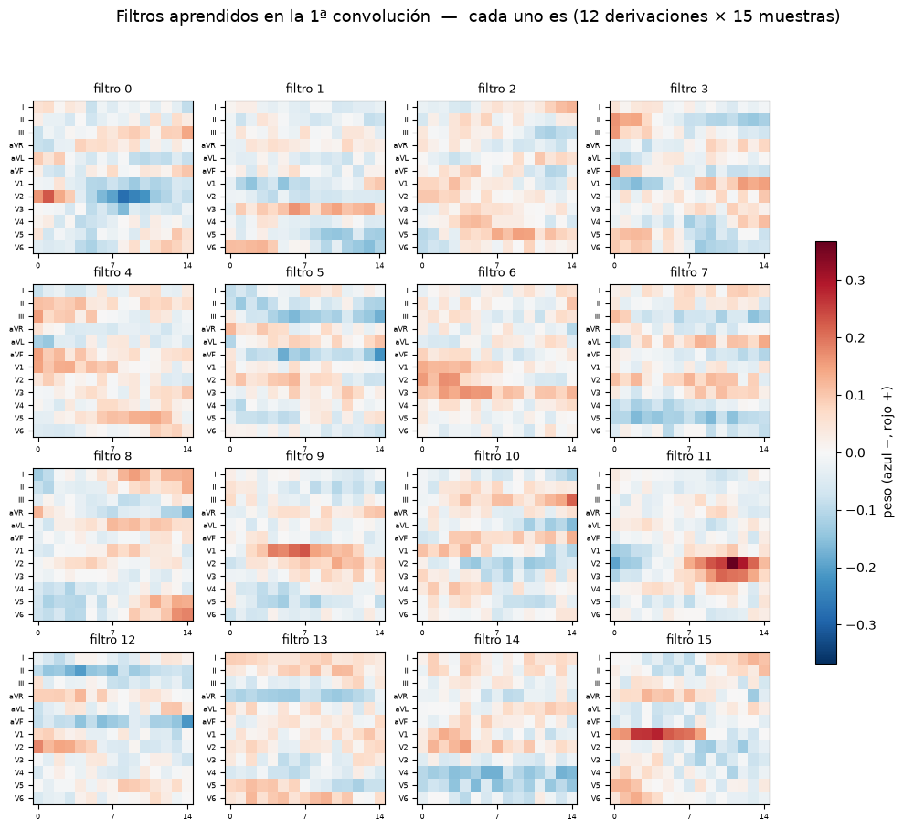
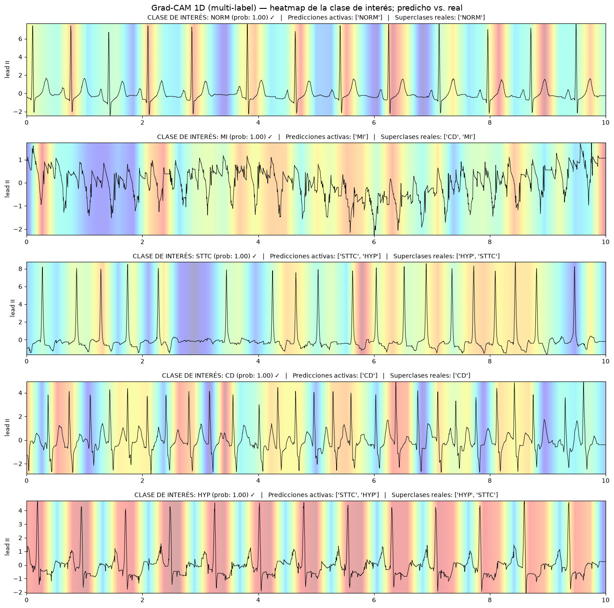
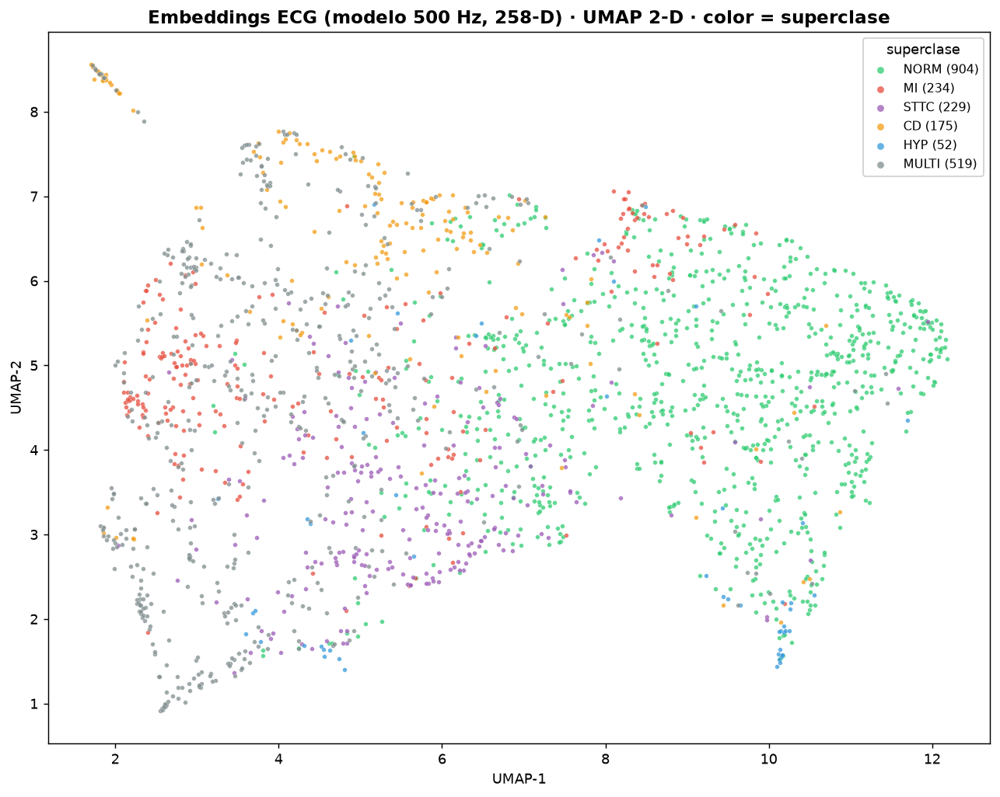
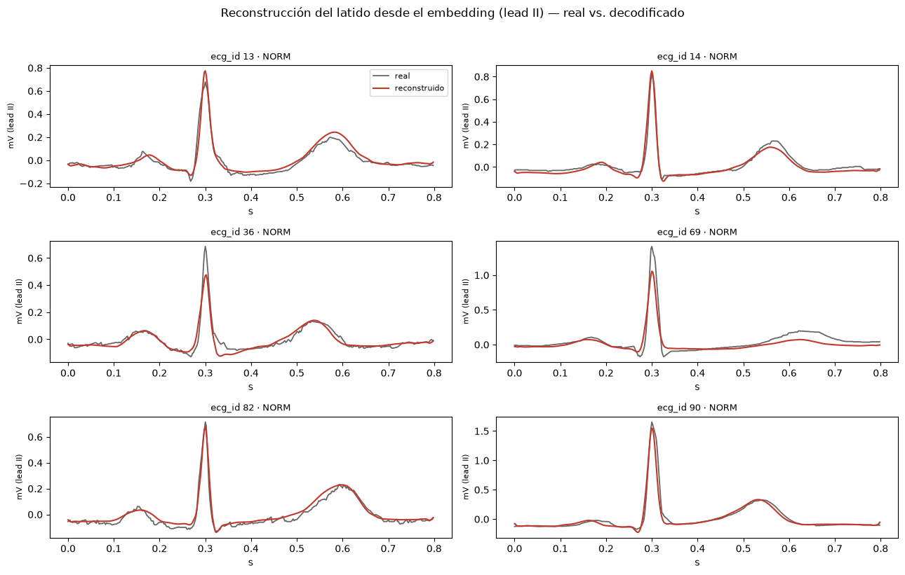
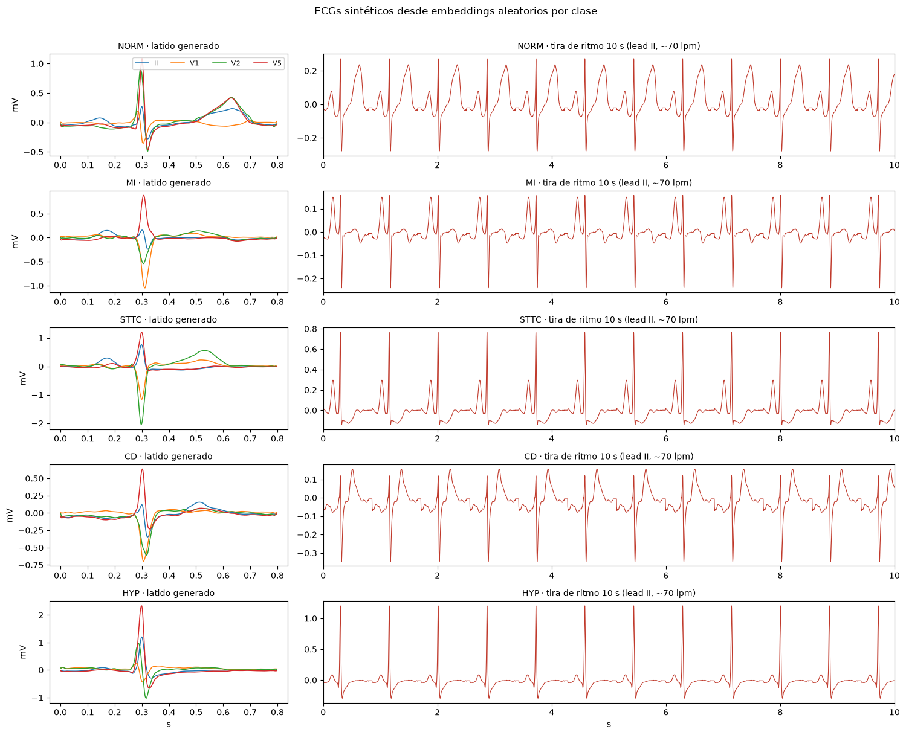
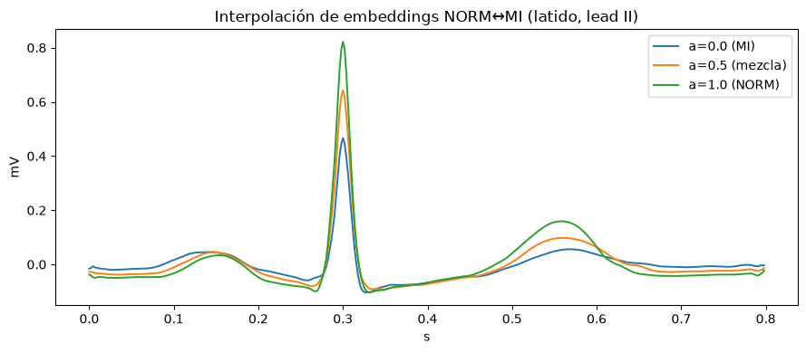

# ecg-cnn1d

Clasificación y generación de electrocardiogramas (ECG) de 12 derivaciones con redes
convolucionales 1-D, usando el dataset **PTB-XL**. Proyecto final de Deep Learning.

Las señales se modelan en las 5 **superclases diagnósticas** de PTB-XL
(`NORM`, `MI`, `STTC`, `CD`, `HYP`) como problema **multi-etiqueta**, con un *split por paciente*
sin fuga entre `train/val/test`.

| Superclase | Significado |
|---|---|
| `NORM` | ECG normal (sano) |
| `MI` | Infarto de miocardio |
| `STTC` | Alteraciones del segmento ST/onda T |
| `CD` | Trastornos de la conducción |
| `HYP` | Hipertrofia |

## ¿Qué hace este proyecto?

A partir de las ondas crudas de ECG el proyecto recorre el ciclo completo de un modelo de deep
learning aplicado a señales biomédicas:

1. **Explorar** el dataset (demografía, desbalance de clases, morfología de la señal).
2. **Entrenar** dos CNN 1-D —una a 100 Hz y otra a 500 Hz— para diagnosticar las 5 superclases.
3. **Comparar** ambas redes: desempeño *vs.* costo de cómputo, para decidir cuál desplegar.
4. **Interpretar** qué aprende la red (filtros, Grad-CAM 1-D y embeddings).
5. **Generar** ECGs sintéticos decodificando el embedding interno del modelo.

### ¿Cómo se ve una entrada?

Cada muestra es una señal de **12 derivaciones × 10 s**. Abajo, un ECG real de un paciente
**NORM (sano)** del dataset (las 6 derivaciones de miembros a la izquierda, las 6 precordiales a la
derecha):

## Arquitectura: red de dos ramas

El clasificador combina la **señal** (rama convolucional) con la **metadata clínica** (edad y sexo).
La rama convolucional resume el ECG en un vector de 256 features mediante *global average pooling*;
se concatena con edad (z-score) y sexo (0/1) para formar un **embedding de 258-D** que pasa a la
cabeza densa con salida **sigmoide de 5 unidades** (una probabilidad por superclase, independientes).

La versión de 500 Hz usa kernels más grandes y un bloque convolucional extra para cubrir una
duración física comparable sobre una señal 5× más larga; la rama de metadata y la cabeza densa son
idénticas en ambas resoluciones.

## Hallazgos

### Sobre el dataset (EDA)

- **21,430 ECGs** de ~18.6k pacientes, balanceado por sexo, edad mediana ~61 años.
- Problema **multi-etiqueta** real: un ECG puede tener varias superclases a la vez.
- **Desbalance marcado**: `NORM` es mayoritaria y `HYP` muy minoritaria
  (`pos_weight` ≈ 7.2 para `HYP` vs. ~1.2 para `NORM`). Esto obliga a usar pesos de clase y
  métricas macro (F1-macro / AUC-macro) en lugar de *accuracy*.
- Señal en mV, sin NaNs → se normaliza **por derivación** con estadísticas de *train*.

### Desempeño de los modelos (en *test*, con umbrales óptimos por clase)

| Métrica | 100 Hz | 500 Hz |
|---|---|---|
| **F1-macro** | 0.7539 | **0.7670** |
| F1-micro | 0.7814 | **0.7920** |
| AUC-macro | 0.9324 | **0.9365** |

**F1 por clase** (y la mejora que aporta subir a 500 Hz):

| Clase | 100 Hz | 500 Hz | Δ (500−100) |
|---|---|---|---|
| NORM | 0.867 | 0.867 | +0.001 |
| MI   | 0.764 | 0.755 | −0.009 |
| STTC | 0.742 | 0.749 | +0.007 |
| CD   | 0.778 | 0.797 | +0.019 |
| **HYP** | 0.620 | **0.667** | **+0.047** |

- `NORM` es la clase más fácil (F1 ≈ 0.87 en ambas); **`HYP` es la más difícil**, por ser la
  minoritaria y de morfología sutil.
- La mejora de 500 Hz se concentra en las clases con morfología fina: **`HYP` (+0.047)** y
  **`CD` (+0.019)**, justo donde la mayor resolución temporal ayuda.

### Costo vs. desempeño (notebook 03)

| | 100 Hz | 500 Hz | × (500/100) |
|---|---|---|---|
| Parámetros | 179,781 | 694,597 | 3.86× |
| Peso `.pt` | 0.73 MB | 2.80 MB | 3.84× |
| FLOPs por inferencia | 100.9 M | 534.8 M | **5.30×** |
| Latencia GPU (1 ECG) | 0.33 ms | 0.36 ms | 1.11× |
| Datos en disco `.npy` | 1.03 GB | 5.14 GB | 4.99× |
| **F1-macro** | 0.7539 | 0.7670 | 1.02× |

**Veredicto:** subir a 500 Hz mejora el F1-macro **+0.0131**, por encima del umbral de decisión
fijado (+0.01), así que el modelo de 500 Hz **se justifica** pese a costar ~5× más cómputo y datos.
En 100 Hz se obtiene ~98% del desempeño con ¼ de los parámetros y una fracción del cómputo: la
opción racional si el objetivo es despliegue en dispositivos modestos o procesamiento masivo.

### Interpretabilidad y embeddings (notebooks 02 y 04)

- Los **filtros de la 1ª convolución** actúan como detectores de pendientes y oscilaciones (el
  equivalente 1-D a los detectores de bordes en imágenes). Cada filtro es una matriz
  `(12 derivaciones × 15 muestras)`: se ve qué derivaciones e instantes activa.

  

- **Grad-CAM 1-D** muestra que, para cada clase, la red mira la región esperada del latido
  (p. ej. el complejo QRS / segmento ST). Para cada superclase se grafica el ECG de test predicho
  con mayor confianza (derivación II) y se superpone el mapa de importancia (cálido = donde más
  miró la red).

  

- En el espacio de embeddings (258-D → UMAP 2-D), **`NORM` se separa con claridad** (gran masa
  verde a la derecha); `MI`, `STTC` y `CD` forman regiones propias y los puntos `MULTI`
  (varias patologías) caen en las fronteras —donde el clasificador más se confunde.

  

### Generación de ECG (notebook 05)

- Un **decoder** (con el encoder congelado) invierte el embedding de 258-D y reconstruye un
  **latido mediano** (PQRST) alineado al pico R. Comparando el latido **real** vs. el
  **decodificado** (derivación II) se recupera una morfología PQRST reconocible:

  

- **Hallazgo clave:** intentar reconstruir los 10 s completos falla (MSE clavado en ~1.0, salida
  plana) porque el *global average pooling* descarta la información de **fase**. Reconstruir el
  **latido mediano alineado al R** resuelve el problema y produce morfología PQRST realista.
- Muestreando una gaussiana por clase sobre los embeddings se generan **latidos sintéticos por
  superclase**, que se repiten al ritmo deseado para formar una tira de 10 s:

  

- También se puede **interpolar entre clases** en el espacio de embeddings
  (`z = a·μ_NORM + (1−a)·μ_MI`) y decodificar, viendo la transición morfológica del latido:

  

- Para variabilidad latido-a-latido y 10 s reales el siguiente paso sería un **VAE 1-D** o un
  modelo de **difusión**.

## Notebooks

| Notebook | Contenido |
|---|---|
| `01_eda_ptbxl.ipynb` | Análisis exploratorio del dataset PTB-XL. |
| `02_modelo_cnn1d_100hz.ipynb` | CNN 1-D (`ECGNet100`) entrenada con señales a 100 Hz (12×1000). |
| `02_modelo_cnn1d_500hz.ipynb` | CNN 1-D (`ECGNet500`) entrenada con señales a 500 Hz (12×5000). |
| `03_comparacion_modelos.ipynb` | Comparación 100 vs 500 Hz: desempeño vs. costo de cómputo (parámetros, FLOPs, latencia, tamaño) y veredicto. |
| `04_embeddings_visualizacion.ipynb` | Embeddings de 258-D del modelo 500 Hz, reducción (UMAP/PCA) y visualización interactiva con Plotly. |
| `05_generador_ecg.ipynb` | Decoder que recibe un embedding y genera un ECG; permite muestrear embeddings aleatorios por clase. |

## Modelos

- `models/ecgnet100_best.pt` — encoder CNN 1-D a 100 Hz (state_dict).
- `models/ecgnet500_best.pt` — encoder CNN 1-D a 500 Hz (state_dict).
- `models/ecg_decoder500.pt` — decoder que reconstruye un latido desde el embedding de 258-D.

## Datos

Las señales (`X_100hz.npy`, `X_500hz.npy`) y las descargas WFDB **no** se versionan por su tamaño;
se regeneran desde [PTB-XL](https://physionet.org/content/ptb-xl/) con los notebooks. Solo se
incluye `data/ptbxl_clean.csv` con las etiquetas y metadatos ya procesados.

## Entorno

Gestionado con [`uv`](https://github.com/astral-sh/uv) (PyTorch + scikit-learn + UMAP + Plotly).
